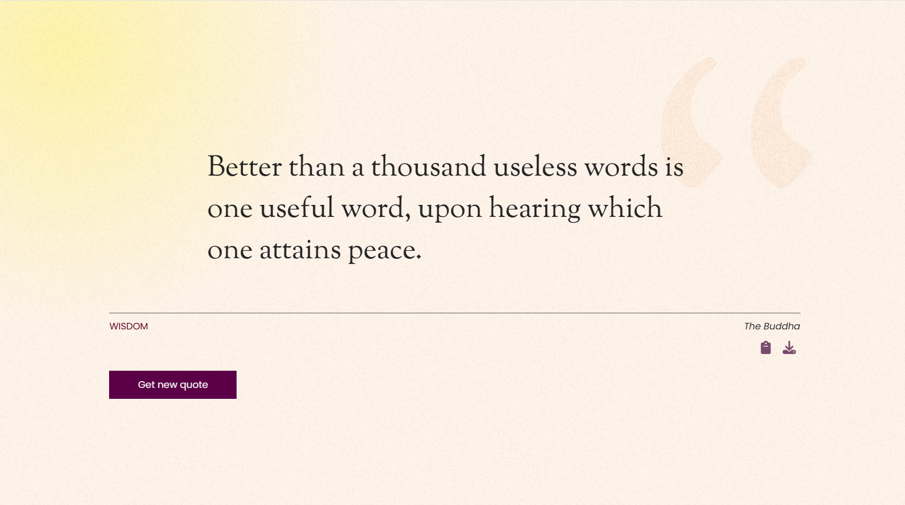

# Random Quote Generator

live 🌐 : [https://randomquote.com](https://javascript-projects-um37.onrender.com) 

## Features:
- **Random Quote Generation**: Generates a random quote with a single button click.
- **Copy to Clipboard**: Easily copy the displayed quote to your clipboard.
- **Export as Image**: Save the quote as an image for sharing or personal use.
- **User-Friendly Interface**: Clean and intuitive UI for a seamless experience.

## Usage:
- Click the "Generate" button to display a random quote.
- Use the "Copy" button to copy the quote text.
- Export the quote as an image using the "Export" option.

## Benefits:
- Inspires creativity and motivation with random quotes.
- Simplifies sharing quotes across platforms.
- Provides a visually appealing and easy-to-use interface.

